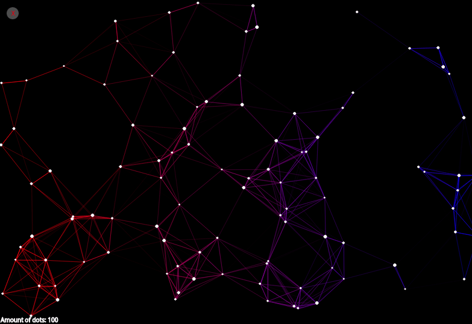

# Connected Dots
Website for creating nice visuals using p5.js 

An online version can be found [here](https://woutuuur.github.io/connected-dots/).

This is what it looks like:

Usage:
1. Open index.html in the webbrowser of your choice.
2. Press o to open the options menu.

Features:
- Choose any two colors
- Change the line length
- Change the amount of dots
- Add dot by clicking anywhere

Uses the [p5.js](https://p5js.org/) library. 
